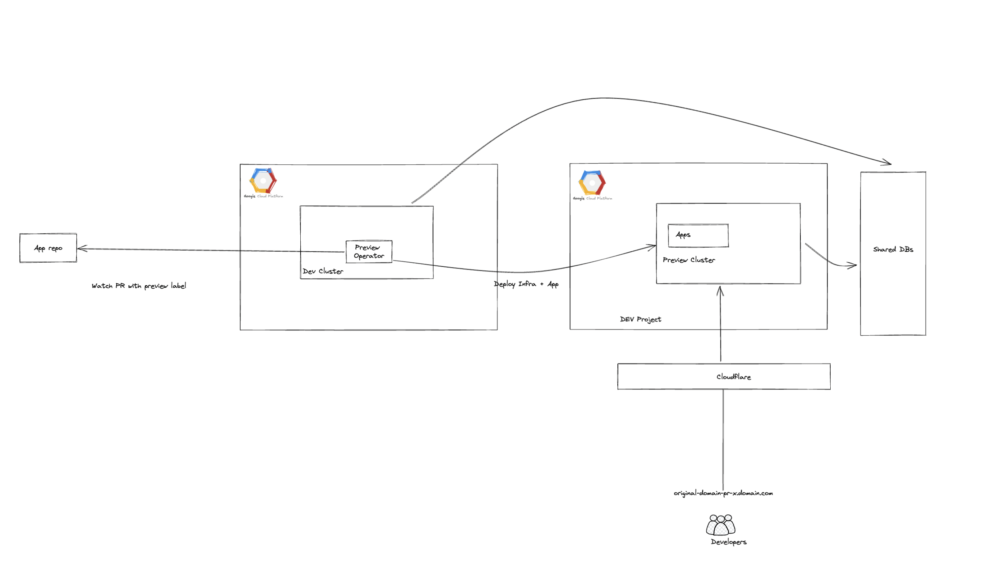

# Multiverse


## Description
Multiverse is a Kubernetes Operator reconcile a [universe](./config/samples) CR to create GCP resources on every Pull Requests:
- VPC Network
- Subnetwork
- CloudNAT
- GKE Cluster
- Addons:
	- External-dns for automatic dns creation with CloudFlare
	- Nginx-ingress
	- Velero for restore source cluster resources into preview cluster
	- Resource-patcher: a small addons that watch GCR Repository and update deployment with matching tags
	- External-secrets: sync secrets from GSM
A funny comment will also be added to the Pull Request.
Default interval for the operator to check if there is any Pull Request is configurable via RequeueAfterSeconds (default 5m).
Underthehood, multiverse use Google Cloud's Config Connector to create GCP Resources, along with Velero to take a snapshot and restore of current cluster.
So Config Connector must be deployed first, hence this Operator only support applications running on GCP.


## Getting Started
You’ll need a Kubernetes cluster to run against. You can use [KIND](https://sigs.k8s.io/kind) to get a local cluster for testing, or run against a remote cluster.
**Note:** Your controller will automatically use the current context in your kubeconfig file (i.e. whatever cluster `kubectl cluster-info` shows).

### Running on the cluster
1. Install Instances of Custom Resources:

```sh
kubectl apply -f examples/universe.yaml
```

2. Build and push your image to the location specified by `IMG`:
	
```sh
make docker-build docker-push IMG=<some-registry>/preview-operator:tag
```
	
3. Deploy the controller to the cluster with the image specified by `IMG`:

```sh
make deploy IMG=<some-registry>/preview-operator:tag
```

### Uninstall CRDs
To delete the CRDs from the cluster:

```sh
make uninstall
```

### Undeploy controller
UnDeploy the controller to the cluster:

```sh
make undeploy
```

### Test It Out
1. Install the CRDs into the cluster:

```sh
make install
```

2. Run your controller (this will run in the foreground, so switch to a new terminal if you want to leave it running):

```sh
make run
```

**NOTE:** You can also run this in one step by running: `make install run`

### Modifying the API definitions
If you are editing the API definitions, generate the manifests such as CRs or CRDs using:

```sh
make manifests
```

**NOTE:** Run `make --help` for more information on all potential `make` targets

More information can be found via the [Kubebuilder Documentation](https://book.kubebuilder.io/introduction.html)

## License

Copyright 2022.

Licensed under the Apache License, Version 2.0 (the "License");
you may not use this file except in compliance with the License.
You may obtain a copy of the License at

    http://www.apache.org/licenses/LICENSE-2.0

Unless required by applicable law or agreed to in writing, software
distributed under the License is distributed on an "AS IS" BASIS,
WITHOUT WARRANTIES OR CONDITIONS OF ANY KIND, either express or implied.
See the License for the specific language governing permissions and
limitations under the License.

Maintainer @phuongnd96
